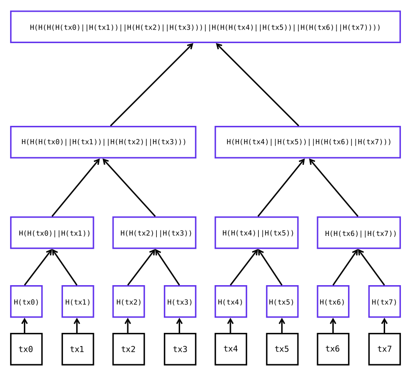

## Description
Hashregate is a Python implmentation of a [Merkle hash tree](https://en.wikipedia.org/wiki/Merkle_tree).

This project takes a list of binary encoded transactions and inserts them into a binary heap structure that performs two main operations:
1. Computing the root hash of a set of 4096 transactions or less (this is the current block size)
2. Efficiently verifying individual transactions given the root hash and a path through the tree from the root to the transaction

## Structure of a Merkle Tree
Merkle hash trees provide a simple way to aggregate a list of data into a single checksum which can be verified efficiently. The structure takes a set of binary-encoded transaction data that's a length of a power of two. The tree is structured as a binary heap, so every node has at most two child nodes.

To compute the checksum initially, all transactions are loaded into the lowest level of the Merkle tree. The root hash of these transactions is computed by recursively hashing the concatenated hash digests of the child nodes, all the way down to the hashes of the transactions. The structure of our Merkle tree is as follows.



## Example
Let's hash a Merkle tree containing 4096 distinct 64 byte transactions.

```bash
$ python example.py
4ecb0d3a67c8762d5a4e40bf5f8650354477948abff170f37910576a058ea12d
Root hash generated in 0.015070676803588867 seconds
```
